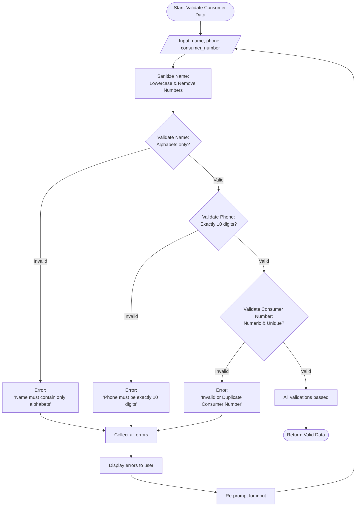
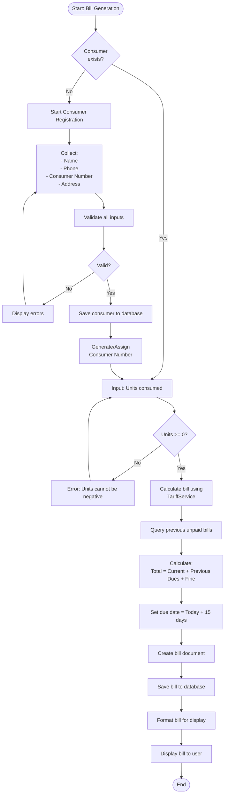
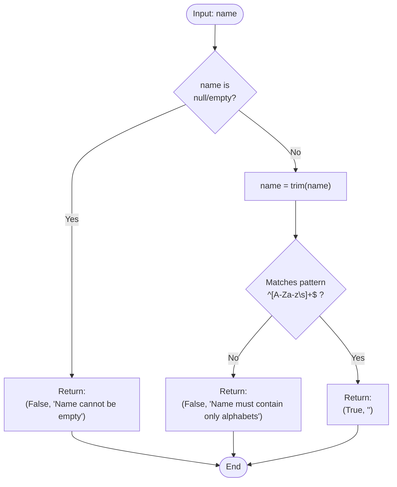
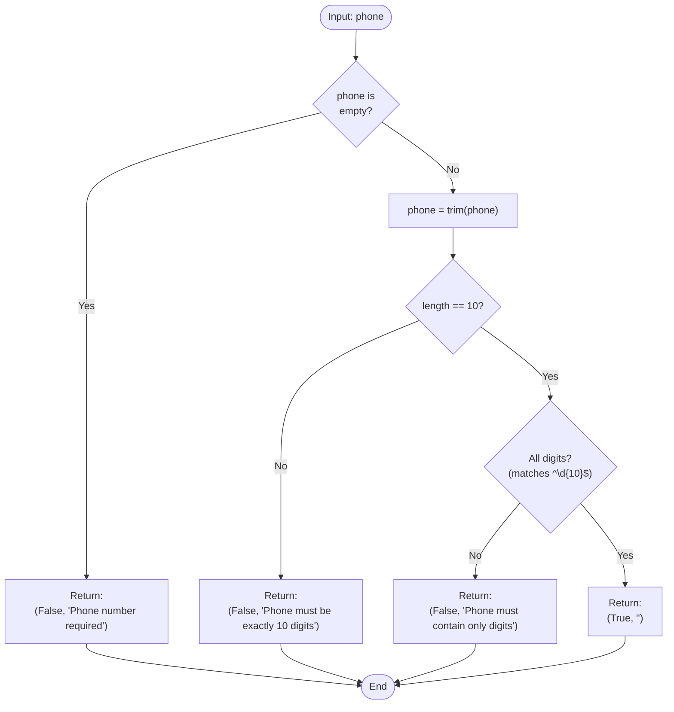
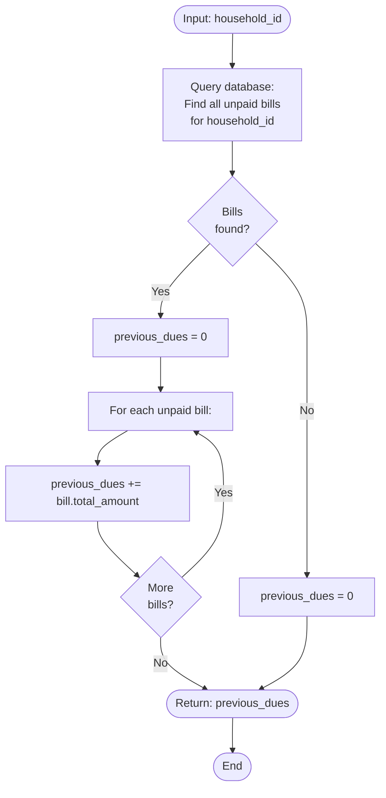
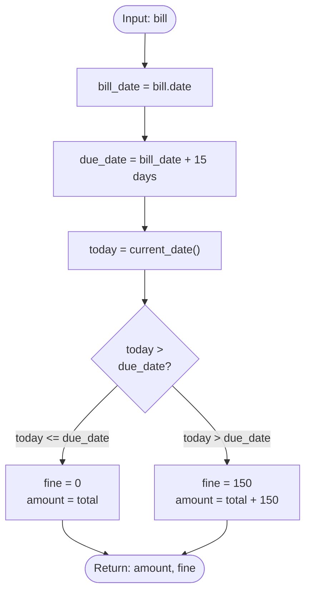
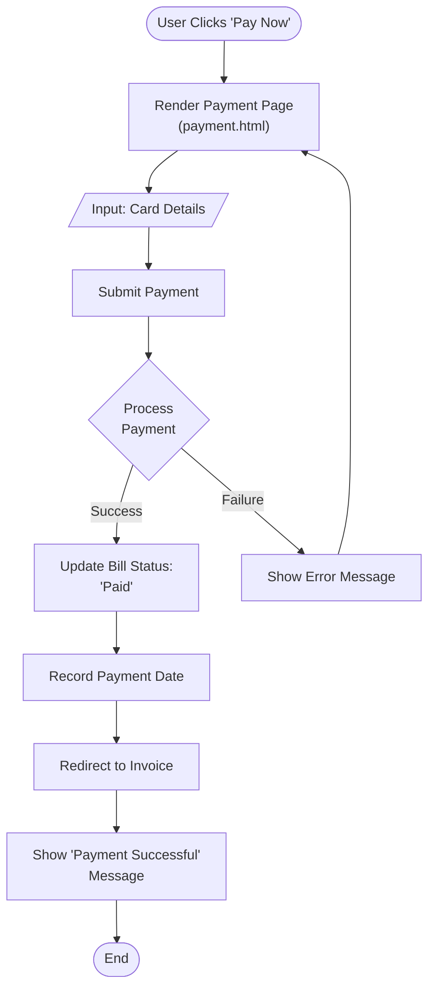

# Algorithm Flowcharts
## Electricity Billing System - Lab Tasks 1 & 2

**Author**: Software Engineering Lab  
**Date**: 2026-01-27

This document contains flowcharts for key algorithms in the electricity billing system, created using Mermaid diagram syntax.

---

## 1. Bill Calculation Algorithm

This flowchart shows the tiered slab-based bill calculation as per Lab Task 1 specifications.

```mermaid
flowchart TD
    Start([Start: Calculate Bill]) --> Input[/"Input: units_consumed"/]
    Input --> CheckZero{units == 0?}
    
    CheckZero -->|Yes| MinCharge[Apply minimum charge: ₹25]
    CheckZero -->|No| InitVars[Initialize:<br/>total = 0<br/>remaining = units<br/>breakdown = []]
    
    InitVars --> Slab1{remaining > 0?}
    
    Slab1 -->|Yes| Calc1["Calculate Slab 1-50:<br/>slab_units = min(remaining, 50)<br/>amount = slab_units × 1.5"]
    Calc1 --> Update1["Update:<br/>total += amount<br/>remaining -= slab_units<br/>breakdown.append(...)"]
    Slab1 -->|No| Done
    
    Update1 --> Slab2{remaining > 0?}
    
    Slab2 -->|Yes| Calc2["Calculate Slab 51-100:<br/>slab_units = min(remaining, 50)<br/>amount = slab_units × 2.5"]
    Calc2 --> Update2["Update:<br/>total += amount<br/>remaining -= slab_units<br/>breakdown.append(...)"]
    Slab2 -->|No| Done
    
    Update2 --> Slab3{remaining > 0?}
    
    Slab3 -->|Yes| Calc3["Calculate Slab 101-150:<br/>slab_units = min(remaining, 50)<br/>amount = slab_units × 3.5"]
    Calc3 --> Update3["Update:<br/>total += amount<br/>remaining -= slab_units<br/>breakdown.append(...)"]
    Slab3 -->|No| Done
    
    Update3 --> Slab4{remaining > 0?}
    
    Slab4 -->|Yes| Calc4["Calculate Slab 151+:<br/>slab_units = remaining<br/>amount = slab_units × 4.5"]
    Calc4 --> Update4["Update:<br/>total += amount<br/>breakdown.append(...)"]
    Slab4 -->|No| Done
    
    Update4 --> Done
    MinCharge --> Done
    Done([Return: total, breakdown])
```

### Example Calculation Flow

Consider 175 units consumed:

1. **Slab 1 (1-50)**: 50 × 1.5 = ₹75, remaining = 125
2. **Slab 2 (51-100)**: 50 × 2.5 = ₹125, remaining = 75
3. **Slab 3 (101-150)**: 50 × 3.5 = ₹175, remaining = 25
4. **Slab 4 (151+)**: 25 × 4.5 = ₹112.5, remaining = 0
5. **Total**: ₹487.50

---

## 2. Input Validation Flowchart

This flowchart shows the validation process for consumer registration.



---

## 3. Complete Bill Generation Process

This is the overall bill generation workflow from consumer registration to bill display.



---

## 4. Name Validation Detailed Flow



---

## 5. Phone Number Validation Flow



---

## 6. Previous Dues Calculation Flow



---

## 7. Due Date & Fine Calculation



---

## 8. Payment Gateway Process



---

## Summary of Algorithms

| Algorithm | Complexity | Key Operations |
|-----------|------------|----------------|
| Bill Calculation | O(1) | Fixed 4 slabs, constant time |
| Name Validation | O(n) | Regex match on name length (after sanitization) |
| Phone Validation | O(1) | Length and digit check |
| Consumer Number Check | O(1) | Database index lookup |
| Previous Dues | O(m) | m = number of unpaid bills |
| Bill Generation | O(1) | Constant operations |

All algorithms are optimized for efficiency with minimal database queries and linear/constant time complexity.
